<h2>GPU passthrough</h2>

* Agenda  
    * [Test environment](#test)
    * [Platform virtualization support](#platform)
    * [Kernel passthrough support](#kernel_pthr)
    * [Driver and PCIe device configuration](#drv_conf)
    * [Performance tuning](#perf)
    * [Qemu-kvm setup](#qemu_setup)
    * [Best Practicesl](#bestprac)
    * [Mic](#mic)
    * [Refernces](#refer)


<h2>Test environment</h2>
    
* Hardware list
    * x1 Inspur NF5212M5 x86 server
    * x1 Dell UltraSharp 24 Monitor
    * x1 Dell GTX 1060 6G graphic card
    * x1 mini 8pin GPU power cable
    * x1 Keyboard
    * x1 Mouse
    * x1 USB HUB
    * x1 500G samsung SSD
    * x2 PCIe riser card
    * x1 256G NVMe M.2 SSD
    * x1 USB wireless adapters for vm
    * x1 USB wireless adapters for host
    * x4 16G 2400MHz samsung DDR4
    * x1 QQ8Q(6240) CLX CPU
    * x1 500W power supply
    * x1 USB wifi connector  
    * x2 NF-A6x25 PWM PREMIUM FANs
    * x1 PCIe card for extend x4 ports USB 3.0 support
    * x1 PCIe card for convert NVMe M.2 interface to PCIe

    <div align="center">
        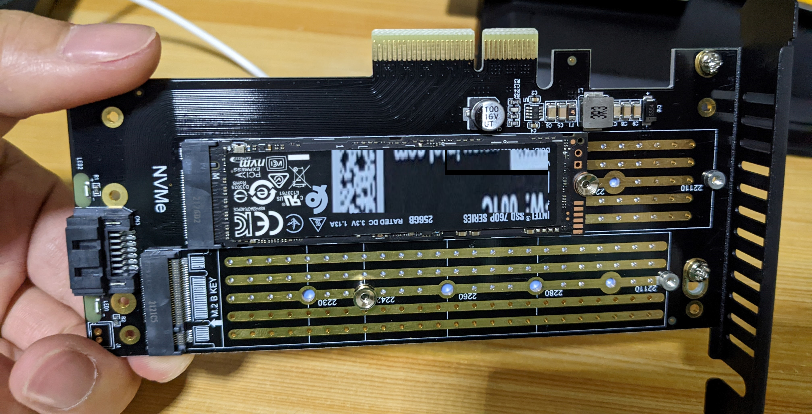
    </div>
    <div align="center">
        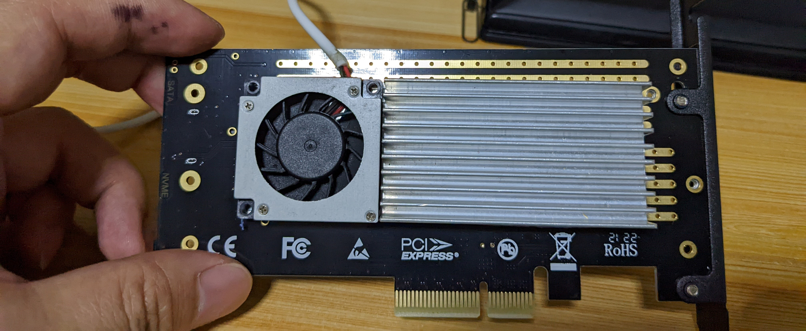
    </div>
    <div align="center">
        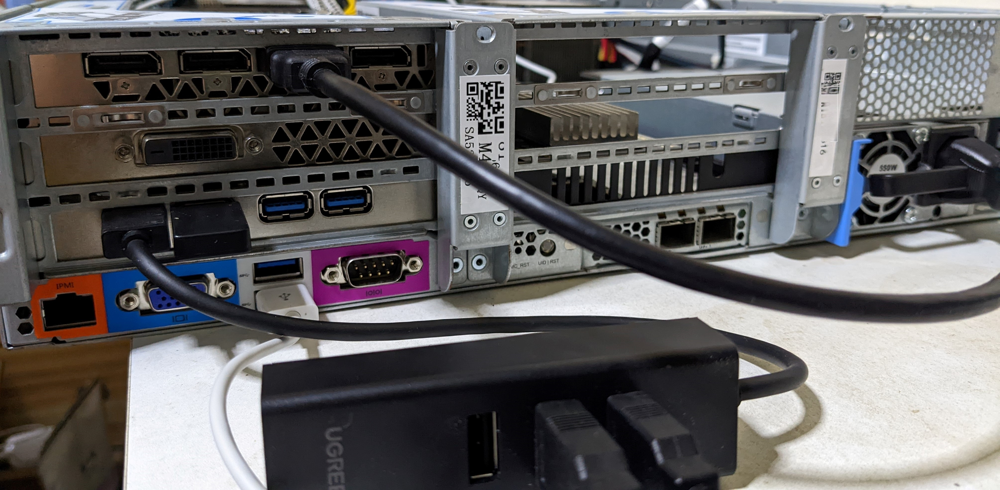
    </div>
    <div align="center">
        
    </div>

* Software list
    * OS: Ubuntu 22.04 TLS
    * Kernel: Linux 5.15.0-43-generic
    * DM: lightdm
    * WM: Awesome
    * X server: xorg
    * Term: xterm


<h2 name="platform">Platform virtualization support</h2>
<ol>
   
<li>CPU Hyperthreading enabled</li>   
<li>BIOS virtualization feature enabled: VT-x and VT-d</li>
<li>UEFI BOOT enabled</li>
<li>Motherboard integrated video device supported and set as default graphic</li>

    BIOS: Processor/Processor Configuration/Hyper Threading Technology -> Enabled
    BIOS: Processor/Processor Configuration/VMX -> Enabled
    BIOS: Processor/IIO Configuration/Intel VT for Directed I/O(VT-d) -> Enabled
    BIOS: Chipset/Miscellaneous Configuration/VGA Priority -> Onboard Device
    BIOS: Advanced/PCI Subsystem Settings/Above 4GB Decoding -> Enabled
    BIOS: Advanced/PCI Subsystem Settings/SR-IOV Support -> Enabled
    BIOS: Advanced/CSM Configuration/Boot Mode -> UEFI Mode

<li>CPU virtualization supported, the following result must be greater than zero</li>
       
    # egrep -c '(vmx|svm)' /proc/cpuinfo
    72
<li>KVM Virtualization supported</li>

    # ls -l /dev/kvm
    crw-rw----+ 1 root kvm 10, 232 Aug  7 13:36 /dev/kvm
    
</ol>

<h2 name="kernel_pthr">Kernel passthrough support</h2>

- Grub config list 
    - Disable selinux

        ```
        selinux=0
        ```
    - Enable console for debugging purpose
        ```
        console=ttyS0,115200
        ```
    - Enable IOMMU(virtualization technoligy)

        The **pt** option only enables IOMMU for devices used in passthrough and will provide better host performance. However, the option may not be supported on all hardware. Revert to previous option if the pt option doesn't work for your host. [From](https://access.redhat.com/documentation/en-us/red_hat_virtualization/4.1/html/installation_guide/appe-configuring_a_hypervisor_host_for_pci_passthrough)
        ```
        iommu=pt intel_iommu=on
        ```
    - Enable ACS override patch
        
        There are multiple devices in the same IOMMU group, this patch allows each device to be placed into its own IOMMU group
        ```
        pcie_acs_override=downstream,multifunction
        ```
    - IOMMU Interrupt Remapping

        All systems using an Intel processor and chipset that have support for Intel Virtualization Technology for Directed I/O (VT-d), but do not have support for interrupt remapping will see such an error. Interrupt remapping support is provided in newer processors and chipsets (both AMD and Intel).

        To identify if your system has support for interrupt remapping:

        ```
        # dmesg | grep 'remapping'
        AMD: "AMD-Vi: Interrupt remapping enabled"
        Intel: "DMAR-IR: Enabled IRQ remapping in x2apic mode"
        ```

        If the passthrough fails because the hardware does not support interrupt remapping, you can consider enabling the **allow_unsafe_interrupts** option if the virtual machines are trusted. The **allow_unsafe_interrupts** is not enabled by default because enabling it potentially exposes the host to MSI attacks from virtual machines
        
        Add following to /etc/default/grub [From](https://forum.proxmox.com/threads/iommu-unsafe-interrupts-enabled-still-error-message.67341/)

        ```
        vfio_iommu_type1.allow_unsafe_interrupts=1
        ``` 
        or add following to /etc/modprobe.d/kvm.conf [From](https://access.redhat.com/articles/66747)
        ```
        options kvm allow_unsafe_assigned_interrupts=1
        ```
        or If you wish to continue using PCI passthrough without interrupt remapping for KVM guests, the previous, vulnerable behavior can be restored by running the following command as root
        ```
        echo 1 > /sys/module/kvm/parameters/allow_unsafe_assigned_interrupts
        ```
    
    - Ignore guest access to unhandled MSRs.
    
        ```
        kvm.ignore_msrs=1
        ```

    
    - Isolate GPU modules and PCIe devices for passthrough
        
        <ol>
            <li>Check GPU info</li>
            
        <ul>
            <li>Check the GPU driver</li>
       
        ```
        # lspci -v | awk -F': ' '/NVIDIA/,/Kernel modules/ { if ( $0 ~ /Kernel modules/ ) { gsub(",","");printf("%-s ", $NF) }} END { print }'
        nvidiafb nouveau snd_hda_intel
        ```
        <li>Check the GPU vender_id and device_id</li>
        
        ```
        # lspci -nn | sed -n 's|^.*NVIDIA.*\[\([[:alnum:]]\{4\}\)\:\([[:alnum:]]\{4\}\)\].*$|\1:\2|p'
        10de:1c03
        10de:10f1
        ```
        </ul>
        
        
        <li>Methods to Isolate GPU</li>
        <ul>
        <li>Blacklisting the aboving drives/modules</li>

        This setting tells the kernel prevent to use those hardwares which need to load drivers during loading process 
 
        ``` 
        # echo "install nvidiafb /bin/true" >> /etc/modprobe.d/local-blacklist.conf
        # echo "install nouveau /bin/true" >> /etc/modprobe.d/local-blacklist.conf
        # echo "install snd_hda_intel /bin/true" >> /etc/modprobe.d/local-blacklist.conf
        ```
        **Warning:**  (Re)move /etc/modprobe.conf, if present, as it supersedes anything in /etc/modprobe.d/* unless you add include /etc/modprobe.d [From](https://wiki.debian.org/KernelModuleBlacklisting)

        <li>Using kernel command line</li>
        
        ```
        modprobe.blacklist=nvidiafb,nouveau,snd_hda_intel
        ```

        <li>Use vfio driver to pre-handle GPU devices during kernel loading <a href="https://mathiashueber.com/windows-virtual-machine-gpu-passthrough-ubuntu/">From</a></li>
        <ol>
        <li>
        Include vfio* drivers in initramfs, they will be loaded at boot time in the order below</li>

        ```
        # echo "vfio vfio_iommu_type1 vfio_virqfd vfio_pci ids=10de:1c03,10de:10f1" >> /etc/initramfs-tools/modules
        ```
        <li>The vfio* drvivers should be loaded at boot time</li>
        
        ```
        # echo "vfio vfio_iommu_type1 vfio_pci ids=10de:1c03,10de:10f1" >> /etc/modules
        ```

        <li>Set higher loading priority than GPU drivers</li>
        
        ```
        # echo "softdep nouveau pre: vfio-pci" >> /etc/modprobe.d/nvidia.conf
        # echo "softdep nvidiafb pre: vfio-pci" >> /etc/modprobe.d/nvidia.conf
        # echo "softdep snd_hda_intel pre: vfio-pci" >> /etc/modprobe.d/nvidia.conf
        ```

        <li>Update vfio module changes</li>

        ```
        # echo "options vfio-pci ids=10de:1c03,10de:10f1" >> /etc/modprobe.d/vfio.conf
        # update-initramfs -u -k all
        # reboot
        ```
        **Note:** This method is much more complex but more safely 

        </ol>
        </ul>
        <li>Enabling huge pages</li>
        Setup 32G hugepages, 16G for guest using and the rest for other purpose

        ```
        default_hugepagesz=1G hugepagesz=1G hugepages=32
        ```
        </ol>

- Grub settings

    ```
    # vim /etc/default/grub
    GRUB_CMDLINE_LINUX="selinux=0 console=ttyS0,115200 iommu=pt intel_iommu=on kvm.ignore_msrs=1 pcie_acs_override=downstream,multifunction vfio_iommu_type1.allow_unsafe_interrupts=1 modprobe.blacklist=nvidiafb,nouveau,snd_hda_intel default_hugepagesz=1G hugepagesz=1G hugepages=32"
    # update-grub && reboot
    ```

<h2 name="drv_conf">Driver and PCIe device configuration</h2>

1. GPU iommu groub check
     

    ```
    # iommu_group() { for i in /sys/kernel/iommu_groups/*/devices/*;do printf "%-12s %-4s" "IOMMU_GROUP" "`echo $i | sed 's|^.*iommu_groups/\([0-9]*\)/dev.*$|\1 |'`"; lspci -nns ${i##*/} ;done }
    # iommu_group | grep -i nvidia
    IOMMU_GROUP  71  65:00.0 VGA compatible controller [0300]: NVIDIA Corporation GP106 [GeForce GTX 1060 6GB] [10de:1c03] (rev a1)
    IOMMU_GROUP  71  65:00.1 Audio device [0403]: NVIDIA Corporation GP106 High Definition Audio Controller [10de:10f1] (rev a1)
    ```
2. Install modules
    ```
    # modprobe vfio
    # modprobe vfio_pci
    # modprobe msr
    # modprobe kvm
    # modprobe kvm_intel
    ```
3. Bind devices
    ```
    # echo 10de 1c03 > /sys/bus/pci/drivers/vfio-pci/new_id
    # echo 10de 10f1 > /sys/bus/pci/drivers/vfio-pci/new_id
    # # ls /dev/vfio/
    71  vfio
    ```

<h2 name="perf">Performance tuning</h2>

1. Increase the memory lock limit on the host (maxsize memory set to 32G)   
    ```
    # ulimit -l 33554432
    # ulimit -l
    33554432
    ```
2. Confirm HugePages
    ```
    # grep -i huge /proc/meminfo
    AnonHugePages:         0 kB
    ShmemHugePages:        0 kB
    FileHugePages:         0 kB
    HugePages_Total:      32
    HugePages_Free:       32
    HugePages_Rsvd:        0
    HugePages_Surp:        0
    Hugepagesize:    1048576 kB
    Hugetlb:        33554432 kB
    # free -h
                   total        used        free      shared  buff/cache   available
    Mem:            62Gi        35Gi        26Gi        10Mi       572Mi        26Gi
    Swap:          8.0Gi          0B       8.0Gi
    ```
3. Mount if there is no hugepage on the mount point
    ```
    # mount -t hugetlbfs hugetlbfs /dev/hugepages
    # mount | grep -i huge
    hugetlbfs on /dev/hugepages type hugetlbfs (rw,relatime,pagesize=1024M)
    ```
    **optional: release the hugepage**
    ```
    # sysctl vm.nr_hugepages=0
    # umount /dev/hugepages
    ```
4. Enable OVMF for UEFI support on QEMU

    OVMF is a port of Intel's tianocore firmware to the qemu virtual machine. This allows easy debugging and experimentation with UEFI firmware; either for testing Ubuntu or using the (included) EFI shell. [From](https://wiki.ubuntu.com/UEFI/OVMF)

    ```
    # apt install ovmf 
    ```

    qemu-system-x86_64 cmd
    ```
    -bios /usr/share/ovmf/OVMF.fd
    ```

<h2 name="qemu_setup">Qemu-kvm setup</h2>
    
1. Install qemu 
    ```
    # apt-get install virt-manager libvirt-daemon -y 
    ```
2. qemu cmd
    ```
    # taskset -c 14-17,32-35 qemu-system-x86_64 \
    -enable-kvm \ 
    -machine type=q35, accel=kvm \
    -nic none \
    -vga none \
    -serial none \
    -parallel none \
    -nographic \
    -cpu host,kvm=off \
    -rtc base=localtime,clock=host \
    -daemonize \
    -m 16G,slots=2 -mem-prealloc \
    -object memory-backend-file,size=16G,share=on,mem-path=/dev/hugepages,share=on,id=node0 \
    -numa node,nodeid=0,memdev=node0 \
    -smp cpus=8,cores=8,sockets=1 \
    -device pcie-root-port,chassis=0,id=pci.0,multifunction=on \
    -device vfio-pci,host=65:00.0,bus=pci.0 \
    -device pcie-root-port,chassis=1,id=pci.1,multifunction=on \
    -device vfio-pci,host=65:00.1,bus=pci.1 \
    -device pcie-root-port,chassis=2,id=pci.2,multifunction=on \
    -device vfio-pci,host=b3:00.0,bus=pci.2 \
    -drive id=disk0,if=virtio,cache=none,format=raw,file=/data/img/win10-disk0.img \
    -drive file=/data/iso/Windows10-Jun19-2022.iso,index=1,media=cdrom \
    -boot dc \
    -bios /usr/share/ovmf/OVMF.fd

    ```

<h2 name="bestprac">Best Practices</h2>

1. Install software
    ```
    # apt-get install qemu-system-x86 virt-manager libvirt-daemon ovmf -y
    # qemu-system-x86_64 --version
    QEMU emulator version 6.2.0 (Debian 1:6.2+dfsg-2ubuntu6.3)
    Copyright (c) 2003-2021 Fabrice Bellard and the QEMU Project developers
    ```
2. Update /etc/default/grub 
    * disable selinux
    * enable console serial output
    * enable virtualization
    * enable iommu
    * bypass unhandle msr
    * enable acs group
    * enable IOMMU Interrupt Remapping
    * blakclist nvidiafb,nouveau,snd_hda_intel during kernel booting
    * set default hugepages size by 1G
    * set 32G hugepage pool
    ```
    GRUB_CMDLINE_LINUX="selinux=0 console=ttyS0,115200 iommu=pt intel_iommu=on kvm.ignore_msrs=1 pcie_acs_override=downstream,multifunction vfio_iommu_type1.allow_unsafe_interrupts=1 modprobe.blacklist=nvidiafb,nouveau,snd_hda_intel default_hugepagesz=1G hugepagesz=1G hugepages=32"
    ```
3. Update grub config and make the config works during the next boot
    ```
    # update-grub
    # reboot
    ```
3. Define iommu group function
    ```
    # iommu_group() { for i in /sys/kernel/iommu_groups/*/devices/*;do printf "%-12s %-4s" "IOMMU_GROUP" "`echo $i | sed 's|^.*iommu_groups/\([0-9]*\)/dev.*$|\1 |'`"; lspci -nns ${i##*/} ;done }
    ```
4. Check out GPU iommu group
    ```
    # iommu_group | grep NVIDIA
    IOMMU_GROUP  71  65:00.0 VGA compatible controller [0300]: NVIDIA Corporation GP106 [GeForce GTX 1060 6GB] [10de:1c03] (rev a1)
    IOMMU_GROUP  71  65:00.1 Audio device [0403]: NVIDIA Corporation GP106 High Definition  Audio Controller [10de:10f1] (rev a1)
    ```
5. Check out additional USB3.0 controller supported by PCIe extend card
    ```
    # iommu_group | grep VIA
    IOMMU_GROUP  90  b4:00.0 USB controller [0c03]: VIA Technologies, Inc. VL805/806 xHCI USB  3.0 Controller [1106:3483] (rev 01)
    ```
6. Check out NVMe controller
    ```
    # iommu_group | grep 6100p
    IOMMU_GROUP  89  b3:00.0 Non-Volatile memory controller [0108]: Intel Corporation SSD Pro 7600p/760p/E 6100p Series [8086:f1a6] (rev 03)
    ```
7. Detach additinal USB3.0 controller and NVMe SSD controller from OS
    ```
    echo 0000:b4:00.0 > /sys/bus/pci/devices/0000:b4:00.0/driver/unbind
    echo 0000:b3:00.0 > /sys/bus/pci/devices/0000:b3:00.0/driver/unbind
    ```
8. Install modules
    ```
    # modprobe vfio
    # modprobe vfio_pci
    # modprobe msr
    # modprobe kvm
    # modprobe kvm_intel
    ```
9. Check vfio group
    ```
    # ls /dev/vfio
    vfio
    ```
10. Attach devices to vfio group
    ```
    # echo 10de 1c03 > /sys/bus/pci/drivers/vfio-pci/new_id
    # echo 10de 10f1 > /sys/bus/pci/drivers/vfio-pci/new_id
    # echo 1106 3483 > /sys/bus/pci/drivers/vfio-pci/new_id
    # echo 8086 f1a6 > /sys/bus/pci/drivers/vfio-pci/new_id
    ```
11. Check vfio group again
    ```
    # ls /dev/vfio
    71  89  90  vfio
    ```
12. Increase the memory lock limit
    ```
    # ulimit -l 33554432
    # ulimit -l
    33554432
    ```
13. Unlimit the max number of user processes
    ```
    # ulimit -u unlimited
    # ulimit -u
    unlimited
    ```
14. Create VM image
    ```
    # mkdir /data
    # qemu-img create -f raw -o preallocation=full /data/img/win10-disk0.img 60G
    Formatting '/data/img/win10-disk0.img', fmt=raw size=64424509440 preallocation=full
    ```
15. Download virtio-win drive
    
    To enable the virtio drive support for window
    ```
    # wget https://fedorapeople.org/groups/virt/virtio-win/direct-downloads/archive-virtio/virtio-win-0.1.221-1/virtio-win.iso
    # ls -l /data/drv/virtio-win.iso
    -rw-r--r-- 1 root root 531486720 Jul 24 11:28 /data/drv/virtio-win.iso
    ```

    qemu-system-x86_64 cmd
    ```
    -drive file=/data/img/win10-disk0.img,if=virtio,format=raw,cache=none,aio=native,id=drive0,index=3,media=disk
    -drive file=/data/drv/virtio-win.iso,index=2,media=cdrom
    ```
16. KVM on x86 implements Hyper-V Enlightenments for Windows guests
    ```
    -cpu host,kvm=off,hv_relaxed,hv_vapic,hv_time,hv_spinlocks=0x1fff
    ```
17. **Optional** 1:1 virtio device to IOThread mapping
    ```
    -object iothread,id=iothread0
    -object iothread,id=iothread1 

    -drive if=none,id=drive0,cache=none,aio=native,format=raw,file=filename 
    -device virtio-blk-pci,drive=drive0,scsi=off,iothread=iothread0 

    -drive if=none,id=drive1,cache=none,aio=native,format=raw,file=filename 
    -device virtio-blk-pci,drive=drive1,scsi=off,iothread=iothread1 
    ```
18. Emulate NVMe device

    **Performance** [From](https://events19.lfasiallc.com/wp-content/uploads/2017/11/Storage-Performance-Tuning-for-FAST-Virtual-Machines_Fam-Zheng.pdf)
    
    - aio: native > threads
    - format: raw > qcow2
    - cache: none >  writeback/directsync/writeback > unsafe

    The vm has 8 vCPU, so can set an NVMe device with 8 hardware queues
    ```
    -device nvme,drive=nvme0,serial=deadbeaf,num_queues=8
    -drive file=/data/img/win10-disk0.img,if=none,format=raw,cache=none,aio=native,id=nvme0,index=3,media=disk
    ```
19. Passthrough NVMe SSD

    -drive file=nvme://HOST:BUS:SLOT.FUNC/NAMESPACE [From](https://www.qemu.org/docs/master/system/images.html#nvme-disk-images)
    ```
    -drive file=nvme://0000:b3:00.0/1
    ```

17. Start OS installation
    ```
    cmd=(
        taskset -c 14-17,32-35
        qemu-system-x86_64
        -name win10
        -enable-kvm
        -machine type=q35,accel=kvm,hmat=on
        -nic none
        -vga none
        -serial none
        -parallel none
        -cpu Cascadelake-Server,kvm=off,hv_relaxed,hv_vapic,hv_time,hv_spinlocks=0x1fff
        -rtc base=localtime,clock=host
        -daemonize
        -k en-us

        -m 16G,maxmem=256G,slots=2 -mem-prealloc -overcommit mem-lock=on
        -smp cpus=8,sockets=1,cores=4,threads=2

        -object memory-backend-file,id=mem,size=16G,mem-path=/dev/hugepages,prealloc=on,share=off,discard-data=on,host-nodes=0,policy=bind,align=1G,merge=on
        -numa node,memdev=mem,cpus=0-7,nodeid=0,initiator=0

        -numa cpu,node-id=0,socket-id=0,core-id=0,thread-id=0
        -numa cpu,node-id=0,socket-id=0,core-id=1,thread-id=0
        -numa cpu,node-id=0,socket-id=0,core-id=2,thread-id=0
        -numa cpu,node-id=0,socket-id=0,core-id=3,thread-id=0
        -numa cpu,node-id=0,socket-id=0,core-id=0,thread-id=1
        -numa cpu,node-id=0,socket-id=0,core-id=1,thread-id=1
        -numa cpu,node-id=0,socket-id=0,core-id=2,thread-id=1
        -numa cpu,node-id=0,socket-id=0,core-id=3,thread-id=1

        -device pcie-root-port,chassis=0,id=pci.0,multifunction=on
        -device vfio-pci,host=65:00.0,bus=pci.0,x-no-kvm-intx=on

        -device pcie-root-port,chassis=1,id=pci.1,multifunction=on
        -device vfio-pci,host=65:00.1,bus=pci.1,x-no-kvm-intx=on

        -device pcie-root-port,chassis=3,id=pci.3,multifunction=on
        -device vfio-pci,host=b4:00.0,bus=pci.3,x-no-kvm-intx=on

        -device nvme,drive=nvme0,serial=deadbeaf,max_ioqpairs=8
        -drive file=/data/img/win10-nvme0-os.img,if=none,format=raw,cache=none,aio=native,id=nvme0,index=3,media=disk

        -drive file=nvme://0000:b3:00.0/1

        -drive file=/data/drv/virtio-win.iso,index=2,media=cdrom
        -drive file=/data/iso/Windows10-Jun19-2022.iso,index=1,media=cdrom
        -boot menu=on
        -bios /usr/share/ovmf/OVMF.fd
    )

    ${cmd[@]}
    ```
16. Switch the monitor to the passthroughed GPU card
17. Connect the keyboard and mouse to the PCIe extend card which has USB support 
18. Install virtio driver during windows installation progress
    
    ```
    Steps:
    1. Where do you want to install Windows? 
    2. Load driver
    3. Select the driver to install 
        RedHat VirtIO SCSI controller(E:\amd64\win10\viostor.inf)
    4. Next
    ```
19. Check hugepage usage on the host 

    There is 32G hugepage totally, 16G is using for the vm and another 16G is free for others
    ```
    # grep -i huge /proc/meminfo
    AnonHugePages:      2048 kB
    ShmemHugePages:        0 kB
    FileHugePages:         0 kB
    HugePages_Total:      32
    HugePages_Free:       16
    HugePages_Rsvd:        0
    HugePages_Surp:        0
    Hugepagesize:    1048576 kB
    Hugetlb:        33554432 kB
    
    # free -h
                   total        used        free      shared  buff/cache   available
    Mem:            62Gi        36Gi        20Gi        10Mi       5.3Gi        25Gi
    Swap:          8.0Gi          0B       8.0Gi
    ```
20. CPU performance 
    1. grub settings
        - isolate cpu
        - cstate=0 
        - pstate=0
        ```
        # vim /etc/default/grub
        selinux=0 console=ttyS0,115200 iommu=pt intel_iommu=on kvm.ignore_msrs=1 pcie_acs_override=downstream,multifunction vfio_iommu_type1.allow_unsafe_interrupts=1 modprobe.blacklist=nvidiafb,nouveau,snd_hda_intel default_hugepagesz=1G hugepagesz=1G hugepages=32 intel_idle.max_cstate=0 processor.max_cstate=0 intel_pstate=disable isolcpus=14-17,32-35
        # update-grub
        # reboot
        ```
    2. Enable Speedstep [From](https://www.intel.com/content/dam/support/us/en/documents/server-products/Intel_Xeon_Processor_Scalable_Family_BIOS_User_Guide.pdf)
    
    <div align="center">
        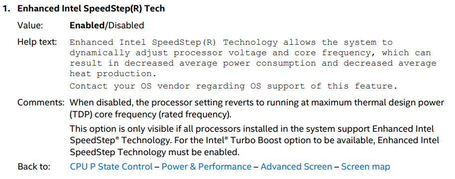
    </div>

    3. check cpu&vcpu mapping
        ```
        # pstree -pt $(pidof qemu-system-x86_64)
        qemu-system-x86(2198)─┬─{CPU 0/KVM}(2220)
                      ├─{CPU 1/KVM}(2221)
                      ├─{CPU 2/KVM}(2222)
                      ├─{CPU 3/KVM}(2223)
                      ├─{CPU 4/KVM}(2224)
                      ├─{CPU 5/KVM}(2225)
                      ├─{CPU 6/KVM}(2226)
                      ├─{CPU 7/KVM}(2227)
                      ├─{call_rcu}(2199)
                      ├─{gdbus}(2230)
                      ├─{gmain}(2229)
                      └─{worker}(2591)
        ```

    3. pin cpu using taskset
        ```
        # ./cpuperf.sh pin -t 14-17,32-35 -n win10 -m 12-13
        status: win10 -- 2278
        -- physical-thread: 14   15   16   17   32   33   34   35
        -- virutal--thread: 2300 2301 2302 2303 2304 2305 2306 2307

        -- manage---thread: 12-13
        -- manage--vthread: 2278 2279 2310 2309 2289
        -- taskset -pc 14 2300
        -- pid 2300's current affinity list: 14-17,32-35
        -- pid 2300's new affinity list: 14
        -- taskset -pc 15 2301
        -- pid 2301's current affinity list: 14-17,32-35
        -- pid 2301's new affinity list: 15
        -- taskset -pc 16 2302
        -- pid 2302's current affinity list: 14-17,32-35
        -- pid 2302's new affinity list: 16
        -- taskset -pc 17 2303
        -- pid 2303's current affinity list: 14-17,32-35
        -- pid 2303's new affinity list: 17
        -- taskset -pc 32 2304
        -- pid 2304's current affinity list: 14-17,32-35
        -- pid 2304's new affinity list: 32
        -- taskset -pc 33 2305
        -- pid 2305's current affinity list: 14-17,32-35
        -- pid 2305's new affinity list: 33
        -- taskset -pc 34 2306
        -- pid 2306's current affinity list: 14-17,32-35
        -- pid 2306's new affinity list: 34
        -- taskset -pc 35 2307
        -- pid 2307's current affinity list: 14-17,32-35
        -- pid 2307's new affinity list: 35
        -- taskset -pc 12-13 2278
        -- pid 2278's current affinity list: 14-17,32-35
        -- pid 2278's new affinity list: 12,13
        -- taskset -pc 12-13 2279
        -- pid 2279's current affinity list: 14-17,32-35
        -- pid 2279's new affinity list: 12,13
        -- taskset -pc 12-13 2310
        -- pid 2310's current affinity list: 14-17,32-35
        -- pid 2310's new affinity list: 12,13
        -- taskset -pc 12-13 2309
        -- pid 2309's current affinity list: 14-17,32-35
        -- pid 2309's new affinity list: 12,13
        -- taskset -pc 12-13 2289
        -- pid 2289's current affinity list: 14-17,32-35
        -- pid 2289's new affinity list: 12,13
        
        # ./cpuperf.sh print cpufreq
        id   Cur/MHz    Max/MHz    Min/MHz    PowerPolicy
        0    3102       2401       1000       performance
        1    3100       2401       1000       performance
        2    3100       2401       1000       performance
        3    3101       2401       1000       performance
        4    3100       2401       1000       performance
        5    3100       2401       1000       performance
        6    3104       2401       1000       performance
        7    3101       2401       1000       performance
        8    3099       2401       1000       performance
        9    3103       2401       1000       performance
        10   3100       2401       1000       performance
        11   3104       2401       1000       performance
        12   3084       2401       1000       performance
        13   3100       2401       1000       performance
        14   3100       2401       1000       performance
        15   3100       2401       1000       performance
        16   3099       2401       1000       performance
        17   3099       2401       1000       performance
        18   3100       2401       1000       performance
        19   3100       2401       1000       performance
        20   3100       2401       1000       performance
        21   3100       2401       1000       performance
        22   3099       2401       1000       performance
        23   3101       2401       1000       performance
        24   3100       2401       1000       performance
        25   3100       2401       1000       performance
        26   3102       2401       1000       performance
        27   3100       2401       1000       performance
        28   3101       2401       1000       performance
        29   3104       2401       1000       performance
        30   3104       2401       1000       performance
        31   3095       2401       1000       performance
        32   3100       2401       1000       performance
        33   3099       2401       1000       performance
        34   3100       2401       1000       performance
        35   3100       2401       1000       performance
        ```
      <div align="center">
        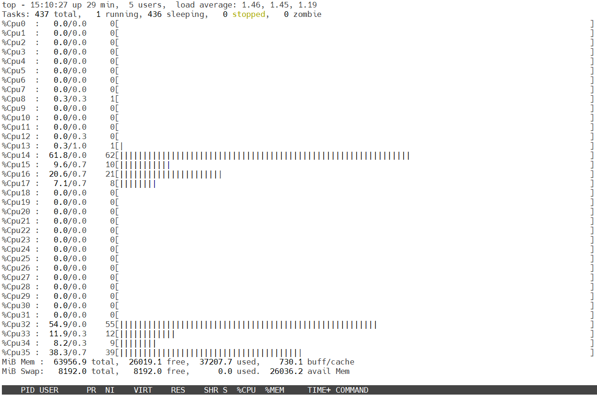
    </div>
21. Boot failed after install nvidia driver
22. Adjust commands
    ```
    cmd=(
        taskset -c 14-17,32-35
        qemu-system-x86_64
        -name win10,debug-threads=on
        -enable-kvm
        -machine type=q35,accel=kvm,hmat=on
        -nic none
        -vga none
        -serial none
        -parallel none
        -cpu Cascadelake-Server,kvm=off,hv_relaxed,hv_vapic,hv_time,hv_spinlocks=0x1fff
        -rtc base=localtime,clock=host
        -daemonize
        -k en-us

        -m 16G,maxmem=256G,slots=2 -mem-prealloc -overcommit mem-lock=on
        -smp cpus=8,sockets=1,cores=4,threads=2

        -object memory-backend-file,id=mem,size=16G,mem-path=/dev/hugepages,prealloc=on,share=off,discard-data=on,host-nodes=0,policy=bind,align=1G,merge=on
        -numa node,memdev=mem,cpus=0-7,nodeid=0,initiator=0

        -numa cpu,node-id=0,socket-id=0,core-id=0,thread-id=0
        -numa cpu,node-id=0,socket-id=0,core-id=1,thread-id=0
        -numa cpu,node-id=0,socket-id=0,core-id=2,thread-id=0
        -numa cpu,node-id=0,socket-id=0,core-id=3,thread-id=0
        -numa cpu,node-id=0,socket-id=0,core-id=0,thread-id=1
        -numa cpu,node-id=0,socket-id=0,core-id=1,thread-id=1
        -numa cpu,node-id=0,socket-id=0,core-id=2,thread-id=1
        -numa cpu,node-id=0,socket-id=0,core-id=3,thread-id=1

        -device nvme,drive=nvme0,serial=deadbeaf,max_ioqpairs=8
        -drive file=/data/img/win10-nvme0-os.img,if=none,format=raw,cache=none,aio=native,id=nvme0,index=3,media=disk

        -device ioh3420,bus=pcie.0,addr=1c.0,multifunction=on,port=1,chassis=1,id=root.1
        -device vfio-pci,host=65:00.0,bus=root.1,addr=00.0,multifunction=on,x-vga=on
        -device vfio-pci,host=65:00.1,bus=root.1,addr=00.1

        -device vfio-pci,host=b4:00.0,bus=pcie.0

        -drive file.driver=nvme,file.device=0000:b3:00.0,file.namespace=1,media=disk

        -drive file=/data/drv/virtio-win.iso,index=2,media=cdrom
        -drive file=/data/iso/Windows10-Jun19-2022.iso,index=1,media=cdrom
        -boot menu=on
        -bios /usr/share/ovmf/OVMF.fd
    )

    echo ${cmd[@]}
    ```
      <div align="center">
        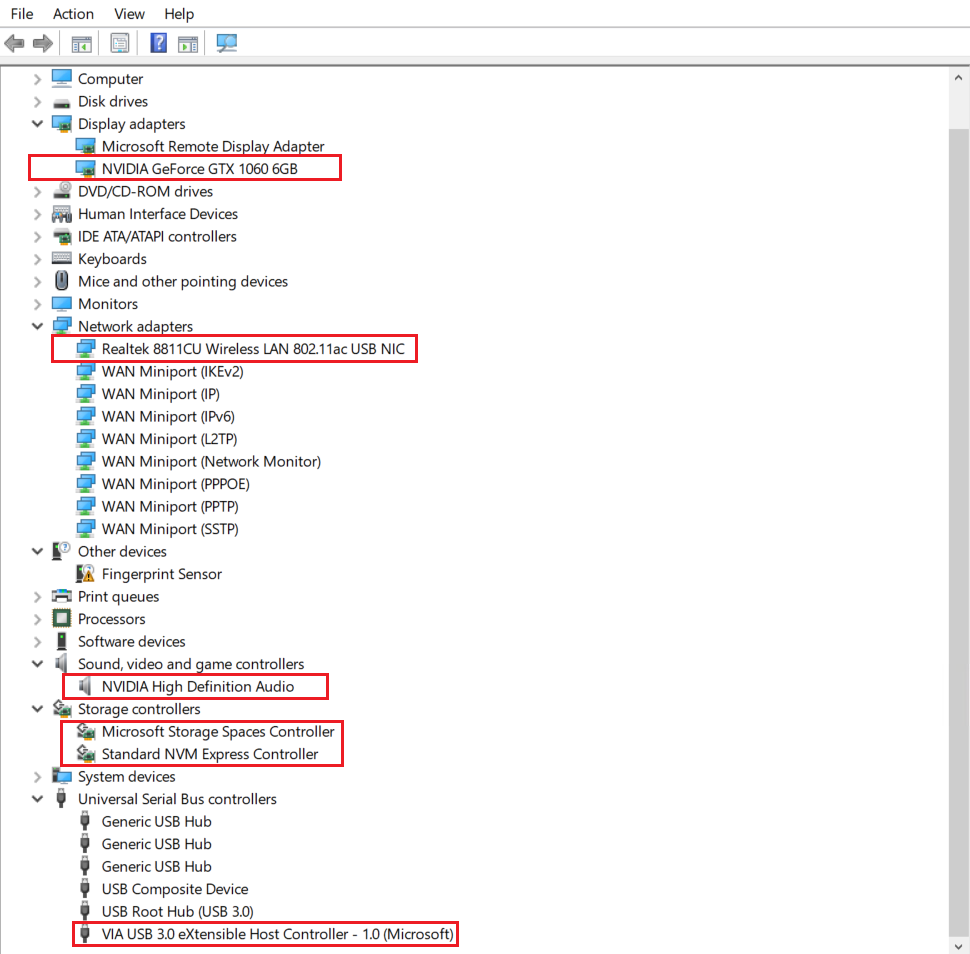
    </div>
     <div align="center">
        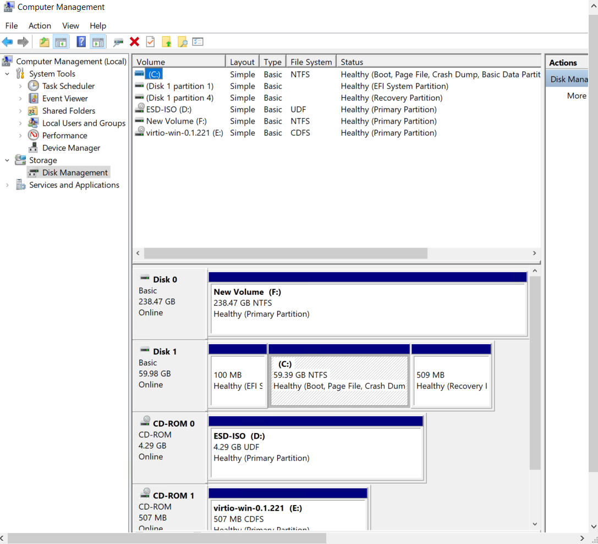
    </div>
23. Install windows10 on NVMe SSD(physical hardware)
    - remove vNVMe img
    ```
    -device nvme,drive=nvme0,serial=deadbeaf,max_ioqpairs=8
    -drive file=/data/img/win10-nvme0-os.img,if=none,format=raw,cache=none,aio=native,id=nvme0,index=3,media=disk
    ```
    - run cmds
    ``` 
    cmd=(
        taskset -c 14-17,32-35
        qemu-system-x86_64
        -name win10,debug-threads=on
        -enable-kvm
        -machine type=q35,accel=kvm,hmat=on
        -nic none
        -vga none
        -serial none
        -parallel none
        -cpu Cascadelake-Server,kvm=off,hv_relaxed,hv_vapic,hv_time,hv_spinlocks=0x1fff
        -rtc base=localtime,clock=host
        -daemonize
        -k en-us

        -m 16G,maxmem=256G,slots=2 -mem-prealloc -overcommit mem-lock=on
        -smp cpus=8,sockets=1,cores=4,threads=2

        -object memory-backend-file,id=mem,size=16G,mem-path=/dev/hugepages,prealloc=on,share=off,discard-data=on,host-nodes=0,policy=bind,align=1G,merge=on
        -numa node,memdev=mem,cpus=0-7,nodeid=0,initiator=0

        -numa cpu,node-id=0,socket-id=0,core-id=0,thread-id=0
        -numa cpu,node-id=0,socket-id=0,core-id=1,thread-id=0
        -numa cpu,node-id=0,socket-id=0,core-id=2,thread-id=0
        -numa cpu,node-id=0,socket-id=0,core-id=3,thread-id=0
        -numa cpu,node-id=0,socket-id=0,core-id=0,thread-id=1
        -numa cpu,node-id=0,socket-id=0,core-id=1,thread-id=1
        -numa cpu,node-id=0,socket-id=0,core-id=2,thread-id=1
        -numa cpu,node-id=0,socket-id=0,core-id=3,thread-id=1

        -device ioh3420,bus=pcie.0,addr=1c.0,multifunction=on,port=1,chassis=1,id=root.1
        -device vfio-pci,host=65:00.0,bus=root.1,addr=00.0,multifunction=on,x-vga=on
        -device vfio-pci,host=65:00.1,bus=root.1,addr=00.1

        -device vfio-pci,host=b4:00.0,bus=pcie.0

        -drive file.driver=nvme,file.device=0000:b3:00.0,file.namespace=1,media=disk

        -drive file=/data/drv/virtio-win.iso,index=2,media=cdrom
        -drive file=/data/iso/Windows10-Jun19-2022.iso,index=1,media=cdrom
        -boot menu=on
        -bios /usr/share/ovmf/OVMF.fd
        )

        echo ${cmd[@]}
    ```

24. Build ubuntu22 guest for development
25. Port sets
    
    1. QEMU is running, a monitor console is provided in order to provide several ways to interact with the virtual machine running. 
   
        ```
        -monitor telnet:127.0.0.1:8999,server,nowait
        ```
        ```# telnet 127.0.0.1 8999```

26. update conf
    
    1. Add bridge network between host and guest 
    2. Add spice server, there are some problems with spice server

    ```
    cmd=(
        taskset -c 14-17,32-35
        qemu-system-x86_64
        -name win10,debug-threads=on
        -machine type=q35,accel=kvm,hmat=on,vmport=off
        -serial none
        -parallel none
        -cpu Cascadelake-Server,kvm=off,hv_relaxed,hv_vapic,hv_time,hv_spinlocks=0x1fff
        -rtc base=localtime,clock=host
        -daemonize
        -k en-us

        -m 16G,maxmem=256G,slots=2 -mem-prealloc -overcommit mem-lock=on
        -smp cpus=8,sockets=1,cores=4,threads=2

        -object memory-backend-file,id=mem,size=16G,mem-path=/dev/hugepages,prealloc=on,share=off,discard-data=on,host-nodes=0,policy=bind,align=1G,merge=on
        -numa node,memdev=mem,cpus=0-7,nodeid=0,initiator=0

        -numa cpu,node-id=0,socket-id=0,core-id=0,thread-id=0
        -numa cpu,node-id=0,socket-id=0,core-id=1,thread-id=0
        -numa cpu,node-id=0,socket-id=0,core-id=2,thread-id=0
        -numa cpu,node-id=0,socket-id=0,core-id=3,thread-id=0
        -numa cpu,node-id=0,socket-id=0,core-id=0,thread-id=1
        -numa cpu,node-id=0,socket-id=0,core-id=1,thread-id=1
        -numa cpu,node-id=0,socket-id=0,core-id=2,thread-id=1
        -numa cpu,node-id=0,socket-id=0,core-id=3,thread-id=1

        -device e1000,netdev=network0
        -netdev tap,id=network0,ifname=tap0,vhostforce=on,script=/usr/local/bin/ifup,downscript=/usr/local/bin/ifdown

        -vga qxl
        -spice port=8998,addr=127.0.0.1,disable-ticketing=on

        -device virtio-serial-pci,id=virtio-serial0,bus=pcie.0,addr=1d.0

        -chardev pty,id=charserial0
        -device isa-serial,chardev=charserial0,id=serial0
        -chardev socket,id=charchannel0,path=/tmp/stream.sock,server=on,wait=off
        -device virtserialport,bus=virtio-serial0.0,nr=1,chardev=charchannel0,id=channel0,name=org.spice-space.stream.0

        -chardev spicevmc,id=charchannel1,name=vdagent
        -device virtserialport,bus=virtio-serial0.0,nr=2,chardev=charchannel1,id=channel1,name=com.redhat.spice.0

        -audiodev spice,id=snd0
        -device ich9-intel-hda
        -device hda-output,audiodev=snd0

        -device ich9-usb-ehci1,id=usb
        -device ich9-usb-uhci1,masterbus=usb.0,firstport=0,multifunction=on
        -device ich9-usb-uhci2,masterbus=usb.0,firstport=2
        -device ich9-usb-uhci3,masterbus=usb.0,firstport=4
        -chardev spicevmc,name=usbredir,id=usbredirchardev1
        -device usb-redir,chardev=usbredirchardev1,id=usbredirdev1
        -chardev spicevmc,name=usbredir,id=usbredirchardev2
        -device usb-redir,chardev=usbredirchardev2,id=usbredirdev2
        -chardev spicevmc,name=usbredir,id=usbredirchardev3
        -device usb-redir,chardev=usbredirchardev3,id=usbredirdev3

        -monitor telnet:127.0.0.1:8999,server,nowait

        -device ioh3420,bus=pcie.0,addr=1c.0,multifunction=on,port=1,chassis=1,id=root.1
        -device vfio-pci,host=65:00.0,bus=root.1,addr=00.0,multifunction=on,x-vga=on
        -device vfio-pci,host=65:00.1,bus=root.1,addr=00.1

        -device vfio-pci,host=b4:00.0,bus=pcie.0

        -drive file=/data/iso/Windows10-Jun19-2022.iso,index=0,media=cdrom

        -device nvme,drive=nvme0,serial=deadbeaf,max_ioqpairs=8
        -drive file=/data/img/win10-nvme0-os.img,if=none,format=raw,cache=none,aio=native,id=nvme0,index=1,media=disk

        -drive file=/data/drv/virtio-win.iso,index=2,media=cdrom

        -drive file.driver=nvme,file.device=0000:b3:00.0,file.namespace=1,media=disk

        -boot order=dc,menu=on
        -bios /usr/share/ovmf/OVMF.fd

        -global kvm-pit.lost_tick_policy=delay
        -global ICH9-LPC.disable_s3=1
        -global ICH9-LPC.disable_s4=1
        )

        echo ${cmd[@]}

    ```

    <div align="center">
        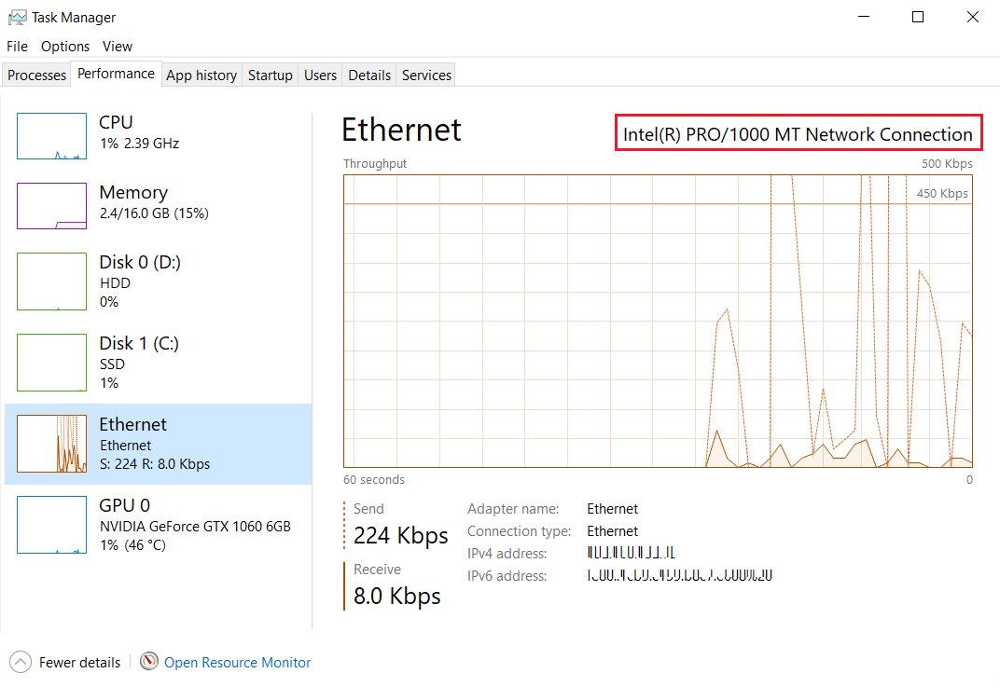
    </div>

    <div align="center">
        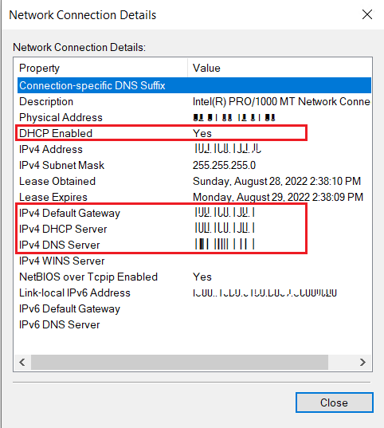
    </div>

    <div align="center">
        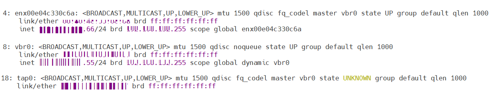
    </div>

    <div align="center">
        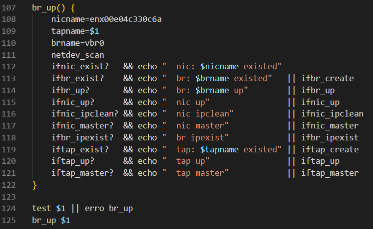
    </div>


 

<h2 name="mic">Mic</h2> 

1. qemu-system-x86_64 device.type
    ```
    # for name in `qemu-system-x86_64 --device help | sed -n 's/^.*"\(.*\)",.*$/\1/p'`;do qemu-system-x86_64 --device $name,help >> qemu-system-x86_64.device.type.txt ;done
    ```
2. Add x-no-kvm-intx=on
    
    pci_irq_handler: assertion `0 <= irq_num && irq_num < pci_num_pins' failed
    
    ```
    -device vfio-pci,host=b4:00.0,bus=pci.3,x-no-kvm-intx=on
    ```

    
    INTx is the legacy PCI interrupt (ie. INTA, INTB, INTC, INTD).  This is
    a level triggered interrupt therefore it continues to assert until the
    device is serviced.  It must therefore be masked on the host while it
    is handled by the guest.  There are two paths we can use for injecting
    this interrupt into the VM and unmasking it on the host once the VM
    samples the interrupt.  When KVM is used for acceleration, these happen
    via direct connection between the vfio-pci and kvm modules using
    eventfds and irqfds.  The x-no-kvm-intx option disables that path,
    instead bouncing out to QEMU to do the same. [From](https://www.spinics.net/lists/kvm/msg161686.html)


<h2 name="refer">References</h2>
<ol>
<li>
<a href="https://www.heiko-sieger.info/running-windows-10-on-linux-using-kvm-with-vga-passthrough">https://www.heiko-sieger.info/running-windows-10-on-linux-using-kvm-with-vga-passthrough</a>
</li>
<li>
<a href="https://www.gnu.org/software/grep/manual/html_node/Character-Classes-and-Bracket-Expressions.html">https://www.gnu.org/software/grep/manual/html_node/Character-Classes-and-Bracket-Expressions.html</a>
</li>
<li>
<a href="https://wiki.archlinux.org/title/Kernel_module">https://wiki.archlinux.org/title/Kernel_module</a>
</li>
<li>
<a href="https://unix.stackexchange.com/questions/276392/how-to-block-drivers-built-into-kernel-i-e-drivers-who-are-not-a-module">https://unix.stackexchange.com/questions/276392/how-to-block-drivers-built-into-kernel-i-e-drivers-who-are-not-a-module</a>
</li>
<li>
<a href="https://www.kernel.org/doc/html/v4.10/admin-guide/kernel-parameters.html">https://www.kernel.org/doc/html/v4.10/admin-guide/kernel-parameters.html</a>
</li>

<li>
<a href="https://www.golinuxcloud.com/disable-blacklist-kernel-module-centos-7-8/">https://www.golinuxcloud.com/disable-blacklist-kernel-module-centos-7-8/</a>
</li>

<li>
<a href="https://documentation.suse.com/sles/12-SP4/html/SLES-all/cha-mod.html">https://documentation.suse.com/sles/12-SP4/html/SLES-all/cha-mod.html</a>
</li>
<li>
<a href="https://pve.proxmox.com/wiki/Pci_passthrough">https://pve.proxmox.com/wiki/Pci_passthrough</a>
</li>
<li>
<a href="https://www.kernel.org/doc/html/latest/admin-guide/mm/hugetlbpage.html#">https://www.kernel.org/doc/html/latest/admin-guide/mm/hugetlbpage.html#</a>
</li>
<li>
<a href="https://events.linuxfoundation.org/wp-content/uploads/2022/03/Huge-Page-Concepts.pdf">https://events.linuxfoundation.org/wp-content/uploads/2022/03/Huge-Page-Concepts.pdf</a>
</li>
<li>
<a href="https://www.qemu.org/docs/master/system/qemu-block-drivers.html">https://www.qemu.org/docs/master/system/qemu-block-drivers.html</a>
</li>
<li>
<a href="https://www.qemu.org/docs/master/system/images.html#nvme-disk-images">https://www.qemu.org/docs/master/system/images.html#nvme-disk-images</a>
</li>
<li>
<a href="https://blogs.oracle.com/linux/post/how-to-emulate-block-devices-with-qemu">https://blogs.oracle.com/linux/post/how-to-emulate-block-devices-with-qemu</a>
</li>
<li>
<a href="https://events19.lfasiallc.com/wp-content/uploads/2017/11/Storage-Performance-Tuning-for-FAST-Virtual-Machines_Fam-Zheng.pdf">https://events19.lfasiallc.com/wp-content/uploads/2017/11/Storage-Performance-Tuning-for-FAST-Virtual-Machines_Fam-Zheng.pdf</a>
</li>
<li>
<a href="https://github.com/virtio-win/virtio-win-pkg-scripts/blob/master/README.md">https://github.com/virtio-win/virtio-win-pkg-scripts/blob/master/README.md</a>
</li>
<li>
<a href="https://docs.fedoraproject.org/en-US/quick-docs/creating-windows-virtual-machines-using-virtio-drivers/">https://docs.fedoraproject.org/en-US/quick-docs/creating-windows-virtual-machines-using-virtio-drivers/</a>
</li>
<li>
<a href="https://qemu-project.gitlab.io/qemu/system/qemu-cpu-models.html">https://qemu-project.gitlab.io/qemu/system/qemu-cpu-models.html</a>
</li>
<li>
<a href="https://events19.linuxfoundation.org/wp-content/uploads/2017/12/Kashyap-Chamarthy_Effective-Virtual-CPU-Configuration-OSS-EU2018.pdf">https://events19.linuxfoundation.org/wp-content/uploads/2017/12/Kashyap-Chamarthy_Effective-Virtual-CPU-Configuration-OSS-EU2018.pdf</a>
</li>
<li>
<a href="https://wiki.qemu.org/images/4/4e/Q35.pdf">https://wiki.qemu.org/images/4/4e/Q35.pdf</a>
</li>
<li>
<a href="https://www.spice-space.org/index.html">https://www.spice-space.org/index.html</a>
<li>
<a href="https://access.redhat.com/documentation/en-us/red_hat_enterprise_linux/7/html/virtualization_deployment_and_administration_guide/chap-graphic_user_interface_tools_for_guest_virtual_machine_management">https://access.redhat.com/documentation/en-us/red_hat_enterprise_linux/7/html/virtualization_deployment_and_administration_guide/chap-graphic_user_interface_tools_for_guest_virtual_machine_management</a>
</li>
<li>
<a href="https://wiki.archlinux.org/title/Network_bridge">https://wiki.archlinux.org/title/Network_bridge</a>
</li>
<li>
<a href="https://wiki.gentoo.org/wiki/QEMU/Options">https://wiki.gentoo.org/wiki/QEMU/Options</a>
</li>
<li>
<a href="https://bugzilla.kernel.org/show_bug.cgi?id=202055">https://bugzilla.kernel.org/show_bug.cgi?id=202055</a>
</li>
<li>
<a href="https://fossies.org/linux/qemu/docs/hyperv.txt">https://fossies.org/linux/qemu/docs/hyperv.txt</a>
</li>
<li>
<a href="https://www.qemu.org/docs/master/system/i386/hyperv.html">https://www.qemu.org/docs/master/system/i386/hyperv.html</a>
</li>
<li>
<a href="https://documentation.suse.com/sles/12-SP4/html/SLES-all/cha-qemu-running.html">https://documentation.suse.com/sles/12-SP4/html/SLES-all/cha-qemu-running.html</a>
</li>
<li>
<a href="https://www.kernel.org/doc/Documentation/IRQ-affinity.txt">https://www.kernel.org/doc/Documentation/IRQ-affinity.txt</a>
</li>
<li>
<a href="https://null-src.com/posts/qemu-optimization/post.php">https://null-src.com/posts/qemu-optimization/post.php</a>
</li>
<li>
<a href="https://www.linux-kvm.org/images/3/34/Kvm-forum-2013-block-dev-configuration.pdf">https://www.linux-kvm.org/images/3/34/Kvm-forum-2013-block-dev-configuration.pdf</a>
</li>
<li>
<a href="https://www.ni.com/en-us/support/documentation/supplemental/11/best-practices-for-using-multiple-network-interfaces--nics--with.html">https://www.ni.com/en-us/support/documentation/supplemental/11/best-practices-for-using-multiple-network-interfaces--nics--with.html</a>
</li>
<li>
<a href="https://qemu.readthedocs.io/en/latest/system/devices/nvme.html">https://qemu.readthedocs.io/en/latest/system/devices/nvme.html</a>
</li>
<li>
<a href="https://superuser.com/questions/1403601/systemd-service-permission-denied">https://superuser.com/questions/1403601/systemd-service-permission-denied</a>
</li>
<li>
<a href="https://www.intel.com/content/dam/support/us/en/documents/server-products/Intel_Xeon_Processor_Scalable_Family_BIOS_User_Guide.pdf">https://www.intel.com/content/dam/support/us/en/documents/server-products/Intel_Xeon_Processor_Scalable_Family_BIOS_User_Guide.pdf</a>
</li>
<li>
<a href="https://wiki.qemu.org/Documentation/Networking#Tap">https://wiki.qemu.org/Documentation/Networking#Tap</a>
</li>
<li>
<a href="https://wiki.archlinux.org/title/QEMU">https://wiki.archlinux.org/title/QEMU</a>
</li>
<li>
<a href="https://www.spice-space.org/spice-user-manual.html">https://www.spice-space.org/spice-user-manual.html</a>
</li>
</ol>


